<h1 align="center">Hi 👋, I'm Parth</h1>

<h3 align="center">Open Source @ JoinMarket (Jam) • Summer of Bitcoin '26 • GenAI Builder</h3>

  
  

<table>
<tr>
<td valign="top"></td>
<td valign="top"></td>
</tr>
</table>

 

<!-- animated contribution graph, refreshed daily by the workflow -->

  

